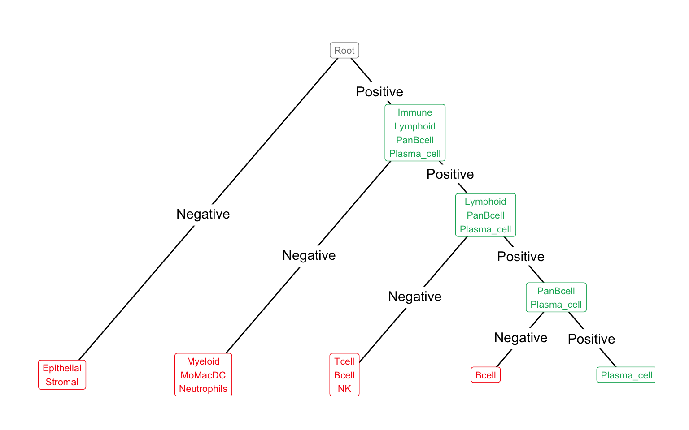

# Exercise 2

# Goals

-   Apply what you learnt in Exercise 1

-   Use an R package for automated cell annotation across multiple samples in *one* dataset

-   Combine multiple datasets

    -   Learn about batch effect

    -   Quantify batch effect

# Introduction

In the second exercise, you will apply what you learnt in exercise 1 to annotate the celltypes in a breast cancer dataset (which you have seen shortly seen at the previous module of this course)

```{r, message=FALSE, warning=F, results=FALSE}

# Load the environment and libraries
# remotes::install_github("carmonalab/scGate",ref="7a3576d")
# remotes::install_github("carmonalab/SignatuR",ref="b1050ae32a600b986f14db236f8d45756aaee05b")
# remotes::install_github("carmonalab/STACAS",ref="05fa74d")
library(Seurat)
library(scGate)
library(SignatuR)
library(STACAS)
library(ggplot2)
library(dplyr)
library(patchwork)
library(parallel)
```

# Set paths

```{r}
my_seed <- 321
set.seed(my_seed)

root <- getwd()

path_data <- file.path(root, "data/Exercise2")
dir.create(file.path(path_data))
path_output <- file.path(root, "output/Exercise2")
dir.create(file.path(path_output))
path_plots <- file.path(root, "plots/Exercise2")
dir.create(file.path(path_plots))
```

# Load the data

## Download the data

If not done before

```{r}
# Download the Peripheral Blood Mononuclear Cells (PBMC) dataset
destfile <- file.path(path_data, "Archive.zip")
if (!file.exists(destfile)) {
  download.file(url = "https://www.dropbox.com/scl/fi/frnqtdn97ybw2s8g2k9xj/Archive.zip?rlkey=5zx2i97nzvce98snjsq77ta56&dl=1",
              destfile = destfile)
  # Decompress file
  unzip(destfile, exdir = path_data)
}
rm(destfile)
```

## Load data and create a Seurat object

```{r, message=FALSE, warning=F}
brca.data = Read10X(file.path(path_data))

# Initialize the Seurat object with the raw (non-normalized data).
obj <- CreateSeuratObject(counts = brca.data, project = "brca",
                          min.cells = 3, min.features = 200)

# For the sake of calculation time and RAM memory constraints in some laptops, we use just a small part of the dataset for this exercise
obj <- subset(obj, downsample=500)
obj

rm(brca.data)
gc()
```

# QC and pre-processing

## Quality control (QC)

```{r paged.print=FALSE}
# The [[ operator can add columns to object metadata. This is a great place to stash QC stats
obj[["percent.mt"]] <- PercentageFeatureSet(obj, pattern = "^MT-")

# Show QC metrics for the first 5 cells
head(obj@meta.data, 5)
```

In the example below, we visualize QC metrics, and use these to filter cells.

```{r, fig.width = 10}
# Visualize QC metrics as a violin plot
VlnPlot(obj, features = c("nFeature_RNA", "nCount_RNA", "percent.mt"), ncol = 3)
VlnPlot(obj, features = c("nFeature_RNA", "nCount_RNA", "percent.mt"), ncol = 3, pt.size = 0) # remove points to see distribution better

# FeatureScatter is typically used to visualize feature-feature relationships, but can be used for anything calculated by the object, i.e. columns in object metadata, PC scores etc.
plot1 <- FeatureScatter(obj, feature1 = "nCount_RNA", feature2 = "percent.mt") + NoLegend()
plot2 <- FeatureScatter(obj, feature1 = "nCount_RNA", feature2 = "nFeature_RNA") + NoLegend()
plot1 + plot2
rm(plot1, plot2)
```

## How many cells per sample?

```{r}
sample.size.pre <- sort(table(obj$orig.ident))
sample.size.pre
barplot(sort(sample.size.pre), las=2)
```

## ℹ️ Exercise

### Select appropriate QC metrics

-   Adjust and select appropriate nFeature_RNA upper threshold

-   Adjust and select appropriate percent.mt threshold

```{r}
thresh_nFeature_RNA <- c(xxx, yyy) # Replace xxx and yyy
thresh_percent.mt <- zzz # Replace zzz

plot1 <- VlnPlot(obj, features = "nFeature_RNA", pt.size = 0) +
  geom_hline(yintercept = thresh_nFeature_RNA, linetype='dashed', col = 'red') + NoLegend()
plot2 <- VlnPlot(obj, features = "nCount_RNA", pt.size = 0) + NoLegend()
plot3 <- VlnPlot(obj, features = "percent.mt", pt.size = 0) +
  geom_hline(yintercept = thresh_percent.mt, linetype='dashed', col = 'red') + NoLegend()
patchwork::wrap_plots(plot1, plot2, plot3, ncol = 3)
rm(plot1, plot2, plot3)
```

## Subset to filter out low quality cells

```{r warning=FALSE}
# Subset data according to our filter creteria
obj <- subset(obj,
              subset =
                nFeature_RNA > thresh_nFeature_RNA[1] &
                nFeature_RNA < thresh_nFeature_RNA[2] &
                percent.mt < thresh_percent.mt)

VlnPlot(obj, features = c("nFeature_RNA", "nCount_RNA", "percent.mt"), ncol = 3, pt.size = 0)
plot1 <- FeatureScatter(obj, feature1 = "nCount_RNA", feature2 = "percent.mt") + NoLegend()
plot2 <- FeatureScatter(obj, feature1 = "nCount_RNA", feature2 = "nFeature_RNA") + NoLegend()
plot1 + plot2
rm(plot1, plot2)
```

## How many cells per sample after QC?

```{r}
sample.size <- table(obj$orig.ident)[names(sample.size.pre)]
sample.size
barplot(sort(sample.size), las=2)
sample.size.filterRatio <- round((sample.size.pre - sample.size)/sample.size.pre*100,2)
sample.size.filterRatio
barplot(sample.size.filterRatio[names(sort(sample.size))], las=2)
```

## Save quality-controlled dataset

```{r}
saveRDS(obj, file.path(path_output, "exercise2_QCed.rds"), compress = FALSE) # compress = FALSE takes more disk space but makes saving and loading a lot faster
```

# Automated cell type annotation

In the previous exercise you annotated clusters of cells manually. You did so by checking which genes are most highly expressed in a cluster and prefereably not in all others, i.e. which specific gene expression characterizes your cell type of interest. As this is very tedious and repetitive, many tools have been developed to automate this process. The basic principle is the same: cell types are characterized by a specific gene expression pattern. Some tools use single genes or a small set of highly specific expression markers. Other tools use extensive sets of genes, called "signatures".

However, each method comes with its own advantages, limitations and drawbacks. For example, on one hand, some annotation tools can annotate a wide range of cell types across many tissues but lack the resolution to annotate subtypes. On the other hand, some packages are highly focused on a specific cell type but can go very deep and are able to very accurately annotate them and their subtypes at high-resolution.

In this exercise, you will apply [scGate](https://github.com/carmonalab/scGate), an R package that automatizes the typical manual marker-based approach to cell type annotation, to enable accurate and intuitive purification of a cell population, without requiring reference gene expression profiles or training data. It's mostly focused on immune cells and other cell types found in tumors.

scGate uses a [database of expert-selected markers](https://github.com/carmonalab/scGate_models/blob/master/human/generic/master_table.tsv) that can be arranged in a hierarchical order. For example, you identify immune cells as CD45+. However, immune cells can be further sub-classified into e.g. CD45+CD8+ cells and others that are CD45+CD8-. B cells for example are CD45+CD8-CD20+ and so on.



```{r}
cache_filename <- file.path(path_output,"exercise2_processed_obj.rds")
nfeatures <- 2000
ndim <- 30

if (file.exists(cache_filename)) {
  obj <- readRDS(cache_filename)
} else {
  obj <- NormalizeData(obj)
  obj <- FindVariableFeatures(obj, nfeat=nfeatures)
  obj <- ScaleData(obj)
  obj <- RunPCA(obj, npcs=ndim)
  obj <- RunUMAP(obj, dims = 1:ndim)
  
  # Select scGate pre-defined gating models
  # In this case we will select a collection of gating models intended to classify cells from the tumor micro-environment at high-resolution, called "TME_HiRes"
  # This step will take about 1-2 minutes
  scGate_models_DB <- get_scGateDB(branch = "master", verbose = T, force_update = TRUE)
  models.TME <- scGate_models_DB$human$TME_HiRes
  
  # Annotate cells
  obj <- scGate(obj, model=models.TME)
  
  saveRDS(obj, cache_filename)
}
```

# Plot UMAP

```{r}
DimPlot(obj, reduction = "umap", group.by = "orig.ident") + theme(aspect.ratio=1)
ggsave(file.path(path_plots,"UMAP_full_by_sample.png"), width = 10, height = 10)
DimPlot(obj, reduction = "umap", group.by = "scGate_multi", label = TRUE) + theme(aspect.ratio=1)
ggsave(file.path(path_plots,"UMAP_full_by_annotation.png"), width = 10, height = 10)
```

Some cells, highlighted in grey, are not annotated ("NA"). One big grey cluster seems to stem from only one patient.

-   What do you think these cells could be? Consider: these are whole tumor samples and we annotated immune cells, tissue, ... which cells are we missing?

-   Why do you think these are difficult to consistently annotate across different patient samples?

-   Bonus question: do you have an idea which feature might distinguish these cells from others?

# Visualize the expression of some genes

```{r, fig.height=20, fig.width=20}
myFeatures <- c("PTPRC","CD2","FOXP3","CD4","CD8A","SPI1","CD79A","MKI67","COL1A1","FCER1G","APOE","C1QB","MS4A1","RGS13","CSF3R","KLRD1","S100A9","S100A8") # just to explore
FeaturePlot(obj, reduction = "umap", features = myFeatures, coord.fixed=T, ncol=5, order = T) 
ggsave(file.path(path_plots,"UMAP_features.png"),width = 40, height = 30)
```

# Check for batch effects

```{r fig.height=10, fig.width=10}
# Download data
download.file("https://www.dropbox.com/scl/fi/nfj9lr2tz85v02607vvaj/sample_from_another_dataset.rds?rlkey=oq5zsm4wwtlhio48em6m0z8yh&dl=1",
              file.path(path_data, "sample_from_another_dataset.rds"))
sample_from_another_dataset <- readRDS(file.path(path_data, "sample_from_another_dataset.rds"))

obj.multi_study <- merge(obj, sample_from_another_dataset)
rm(sample_from_another_dataset)
gc()

# For your convenience, the cell types in the ""sample_from_another_dataset" were already assigned
# So, no need to run scGate for cell annotation again
obj.multi_study <- obj.multi_study |> NormalizeData() |> FindVariableFeatures(nfeat=nfeatures) |> ScaleData() |> RunPCA(npcs=ndim) |> RunUMAP(dims = 1:ndim)

DimPlot(obj.multi_study, reduction = "umap", group.by = "scGate_multi", label = F) + theme(aspect.ratio=1)
DimPlot(obj.multi_study, reduction = "umap", group.by = "orig.ident") + theme(aspect.ratio=1)
```

Looking at the above UMAPs, you can see that the study1_sample that was added from another dataset forms completely separate clusters. What happened here? Does this patient have completely different CD4 and CD8 celltypes? No - it's just batch effect.

## Batch effect explained

"Single-cell data is often compiled from multiple experiments with differences in capturing times, handling personnel, reagent lots, equipment, and even technology [=sequencing] platforms. These differences lead to large variations or batch effects in the data, and can confound biological variations of interest during data integration. As such, effective batch-effect removal is essential. Batch effects can be highly nonlinear, making it difficult to correctly align different datasets while preserving key biological variations" ([Tran et al. 2020](https://genomebiology.biomedcentral.com/articles/10.1186/s13059-019-1850-9#:~:text=Batch%20effects%20can%20be%20highly,(scRNA%2Dseq)%20data.)).

For this reason, several different tools have been developed trying to address this problem. You will learn about 2 different tools (one in exercise 2 and another one in exercise 3) and how to evaluate whether batch effect was successfully mitigated or not.

## Evaluate the batch effect in CD8 T cells

-   First, lets plot the data

    -   The first PCA biplot shows only samples from the same "sc5r" dataset

    -   The second PCA biplot shows samples from all three datasets together

-   What can you observe in the PCA plots below?

```{r}
# We create a subset of CD8T cells from the initial dataset
all_samples <- unique(obj.multi_study$orig.ident)
all_samples_except_study1_sample <- all_samples[!grepl("study1_sample", all_samples)]
obj.CD8T <- subset(obj.multi_study, subset = scGate_multi == "CD8T" & orig.ident %in% all_samples_except_study1_sample)

# # We create a subset of CD8T cells from the initial dataset and including the newly added sample from another daataset
obj.CD8T.multi <- subset(obj.multi_study, subset = scGate_multi == "CD8T")

obj.CD8T <- obj.CD8T |> NormalizeData() |> FindVariableFeatures() |> ScaleData() |> RunPCA(npcs=ndim) |> RunUMAP(dims = 1:ndim)
DimPlot(obj.CD8T, reduction = "pca", group.by = "orig.ident") + theme(aspect.ratio=1)

obj.CD8T.multi <- obj.CD8T.multi |> NormalizeData() |> FindVariableFeatures() |> ScaleData() |> RunPCA(npcs=ndim) |> RunUMAP(dims = 1:ndim)
DimPlot(obj.CD8T.multi, reduction = "pca", group.by = "orig.ident") + theme(aspect.ratio=1)
```

Let's put a number on this, so we can quantify the batch effect and whether we actually can reduce it. One metric to do sp is the silhouette coefficient that you have used before in the previous module of this course.

## Silhouette score to assess clustering

In short, the silhouette coefficient tells us how well-defined the clusters are. A higher silhouette coefficient indicates that the clusters are well apart from each other and clearly distinguished, while a lower or negative silhouette coefficient suggests that the clusters might be overlapping or poorly defined.

-   What do we want in this case, is a high or low silhouette score?

Remember that we want the batches (clusters) to be mixed. In the above PCA we saw that the sample clusters from dataset 1 are well mixed, i.e. there is no batch effect, and that the sample from the second dataset formed a well-defined cluster well apart from the others.

-   So, what are the silhouette coefficients for the samples in dataset 1 (no batch effect)? And what is the silhouette coefficient for all samples together (i.e. the silhouette coefficient of "study1_sample")? What should the silhouette scores be after batch effect mitigation, lower or higher?

```{r}
Idents(obj.CD8T) <- "orig.ident"
Idents(obj.CD8T.multi) <- "orig.ident"

# Define function to calculate silhouette widths
# INPUT: Seurat object with sample annotation stored in object$orig.ident
# RETURNS: A list, containing:
# - plot: a silhouette plot
# - SilW_per_cell: Silhouette coefficient for each cell (Vector)
# - AvgSilW_per_sample: Average silhouette coefficient per sample (Vector)

calc_sil_widths <- function(object){
  return_list <- list()
  dist.matrix <- dist(Embeddings(object = object[["pca"]])[, 1:ndim])
  clusters <- object$orig.ident
  sil <- cluster::silhouette(as.numeric(as.factor(clusters)), dist = dist.matrix)
  object$sil <- sil[, "sil_width"]
  
  return_list[["plot"]] <- factoextra::fviz_silhouette(sil, print.summary = TRUE, ggtheme = theme_classic()) +
    scale_fill_discrete(labels = unique(object$orig.ident)) + guides(col="none")
  
  SilW_per_cell <- c()
  AvgSilW_per_sample <- c()
  for (sample in unique(object$orig.ident)) {
    sample_cells_sils <- object$sil[which(object$orig.ident == sample)]
    SilW_per_cell <- c(SilW_per_cell, sample_cells_sils)
    AvgSilW_per_sample <- c(AvgSilW_per_sample, setNames(mean(sample_cells_sils), sample))
  }
  return_list[["SilW_per_cell"]] <- SilW_per_cell
  return_list[["AvgSilW_per_sample"]] <- AvgSilW_per_sample
  return(return_list)
}

# Lets have a look at the silhouette coefficients looking at only the samples from dataset 1
obj.CD8T.sil_list <- calc_sil_widths(obj.CD8T)
print(obj.CD8T.sil_list$plot)

obj.CD8T.multi.sil_list <- calc_sil_widths(obj.CD8T.multi)
print(obj.CD8T.multi.sil_list$plot)
```

```{r}
print(paste("The single study average silhouette width (across all cells in all samples) is:", mean(obj.CD8T.sil_list$SilW_per_cell) |> round(2)))
print(paste("The multi study average silhouette width (across all cells in all samples) is:", mean(obj.CD8T.multi.sil_list$SilW_per_cell) |> round(2)))

print(paste("The average silhouette width of sample 'study1_sample' is:", obj.CD8T.multi.sil_list$AvgSilW_per_sample["study1_sample"] |> round(2)))
```

As you can see, study1_sample shows a much higher average silhouette width than all the other samples, as it forms a very distinct separate cluster. Thereby, it increases the overall average silhouette score as well.

## Apply batch correction

Here we use the STACAS package as an example of one of many different "integration" methods. The different methods use different theoretical approaches to solve this problem but the goal of all is the same: to mitigate batch effect.

```{r}
obj.multi_study.list <- SplitObject(obj.multi_study, split.by = "orig.ident")
obj.multi_study.batch_corrected <- Run.STACAS(obj.multi_study.list)
obj.multi_study.batch_corrected <- RunUMAP(obj.multi_study.batch_corrected, reduction = "pca", dims = 1:ndim, seed.use=my_seed)
rm(obj.multi_study.list)
gc()
```

## Clustering after batch correction

```{r}
# Lets compare the UMAPs
## BEFORE
DimPlot(obj.multi_study, reduction = "umap", group.by = "scGate_multi", label = F) +
  theme(aspect.ratio=1) +
  ggtitle("UMAP - BEFORE batch correction - clusters labelled by cell types")
DimPlot(obj.multi_study, reduction = "umap", group.by = "orig.ident") +
  theme(aspect.ratio=1) +
  ggtitle("UMAP - BEFORE batch correction - clusters labelled by sample")

DimPlot(obj.multi_study.batch_corrected, reduction = "umap", group.by = "scGate_multi", label = F) +
  theme(aspect.ratio=1) +
  ggtitle("UMAP - AFTER batch correction - clusters labelled by cell types")
DimPlot(obj.multi_study.batch_corrected, reduction = "umap", group.by = "orig.ident") +
  theme(aspect.ratio=1) +
  ggtitle("UMAP - AFTER batch correction - clusters labelled by sample")


# As above, lets have a look at the PCAs and silhouette widths but now after we applied batch correction
obj.CD8T.batch_corrected <- subset(obj.multi_study.batch_corrected, subset = scGate_multi == "CD8T" & orig.ident %in% all_samples_except_study1_sample)
obj.CD8T.multi.batch_corrected <- subset(obj.multi_study.batch_corrected, subset = scGate_multi == "CD8T")

DimPlot(obj.CD8T.batch_corrected, reduction = "pca", group.by = "orig.ident") +
  theme(aspect.ratio=1) +
  ggtitle("PCA - AFTER batch correction - all samples from same dataset")
DimPlot(obj.CD8T.multi.batch_corrected, reduction = "pca", group.by = "orig.ident") +
  theme(aspect.ratio=1) +
  ggtitle("PCA - AFTER batch correction - with study1_sample from another dataset")

# Lets have a look at the silhouette coefficients looking at only the samples from dataset 1
obj.CD8T.BC.sil_list <- calc_sil_widths(obj.CD8T.batch_corrected)
print(obj.CD8T.BC.sil_list$plot)
print(paste("The single study average silhouette width (across all cells) is:", mean(obj.CD8T.BC.sil_list$SilW_per_cell)))

obj.CD8T.multi.BC.sil_list <- calc_sil_widths(obj.CD8T.multi.batch_corrected)
print(obj.CD8T.multi.BC.sil_list$plot)
print(paste("The multi study average silhouette width (across all cells) is:", mean(obj.CD8T.multi.BC.sil_list$SilW_per_cell)))
```

You can see that after batch correction, in the UMAP, the cells from study1_sample are well mixed with the cells from the original dataset. For example, the CD4 cells from study1_sample are among the CD4 cellsfrom the original dataset and do not form a separate cluster anymore.

Also in the PCA, the cells from all samples are well mixed.

The silhouette score for all samples are very low, meaning that the cells from each sample are well mixed with the cells from the other samples.

# Conclusions

You learnt **how to automatically annotate cells in an scRNA-seq dataset, consisting of multiple samples**, by the example of one R package. It applies marker-based hierarchical gating which is very good if you have very clear binary markers that are either positive/negative. But what if you have gradients of gene expression levels? Or if you go very deep: if you want to look at different CD8 subtypes? At some point, you will run out of markers that are distinctly positive/negative. In this case, gene expression profiles can be very useful for further refinement (e.g. [this tool](https://github.com/carmonalab/ProjecTILs)).

Furthermore, we have seen that **batch effect needs to be mitigated when combining multiple datasets**. We also used silhouette scoring as a simple metric to quantify how well-clusters are defined (or mixed in this case) to evaluate the batch effect before and after "integration". You might ask: "but if I just mix the cells very well randomly, the silhouette score would be minimal, thus TECHNICAL batch effect perfectly removed...but then wouldn't cell types also be mixed, i.e. the BIOLOGICAL separation also be removed"? Yes, indeed. In older integration method that was a big problem: cells were mixed and batch effect somewhat mitigated but at the cost of also mixing some celltypes. People have long thought about that and come up with different strategies to integrate scRNA-seq datasets. In the next exercise we will see a well-established (old) popular integration method called "Harmony" and compare its results with a newer method which tried to address its weaknesses. By this, we hope to sharpen your eyes to detect and check for technical artefacts, in order to prevent them. Always be aware of your data's quality and possible technical and biological artefacts, possible biases and limitations.


# \-\-\-\-\-\-\-\-\-\-\-\-\-\-\-\-\-\-\-\-\-\-\-\-\-\-\-\-\-\-\-\-\-\-\-\-\--

# Solution

The explanation why the solution contains exactly these thresholds is:
Unfortunately there is no _one correct solution_. It's rather an estimation by experience and depending on your needs.
Setting LESS stringent thresholds includes more cells...and more low quality cells.
Setting MORE stringent thresholds includes less cells...and less low quality cells.

One possibility might be that you set it to remove the lowest 1% (or 0.1% or ...) and highest 1% of cells for each threshold.
However, as explained in exercise 1, the thresholds could be different for each cell type.
Also, it might be that one or multiple sample were in bad shape, e.g. because the cells were stored or treated under stressful conditions, and subsequently more stringent thresholds might be required.

```{r warning=FALSE}
thresh_nFeature_RNA <- c(200, 5000)
thresh_percent.mt <- 17

plot1 <- VlnPlot(obj, features = "nFeature_RNA", pt.size = 0) +
  geom_hline(yintercept = thresh_nFeature_RNA, linetype='dashed', col = 'red') + NoLegend()
plot2 <- VlnPlot(obj, features = "nCount_RNA", pt.size = 0) + NoLegend()
plot3 <- VlnPlot(obj, features = "percent.mt", pt.size = 0) +
  geom_hline(yintercept = thresh_percent.mt, linetype='dashed', col = 'red') + NoLegend()
patchwork::wrap_plots(plot1, plot2, plot3, ncol = 3)
rm(plot1, plot2, plot3)
```